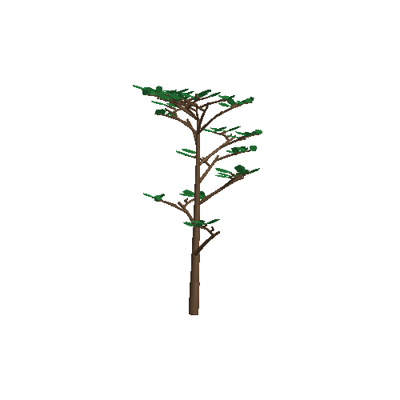
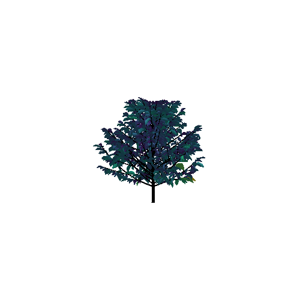

```@raw html
---
# https://vitepress.dev/reference/default-theme-home-page
layout: home

hero:
  name: "PlantGeom.jl"
  text: "Everything 3D for plants 🌱"
  tagline: Read, build, reconstruct, and visualize 3D scenes with plants.
  image:
    src: /logo.png
    alt: "Coffee plant"
  actions:
    - theme: brand
      text: Showcase
      link: /getting_started/showcase
    - theme: alt
      text: View on Github
      link: https://github.com/VEZY/PlantGeom.jl
    - theme: alt
      text: API
      link: /API

features:
  - icon: 
    title: Read & write 3D files
    details: Compatible with `.opf`, `.ops`, `.mtg` files and any standard format using MeshIO.jl
    link: /io
  - icon: 
    title: Build and simulate plants
    details: Simulate plant growth using our growth API, also compatible with PlantSimEngine.jl
    link: /build_and_simulate_3d_plants/growth_api
  - icon: 
    title: Visualize 3D plants
    details: Color by attributes, add legends, customize the visualization and integrate with other plots using Makie.jl
    link: /getting_started/makie_3d
---
```

````@raw html
<p style="margin-bottom:2cm"></p>

<div class="vp-doc" style="width:80%; margin:auto">
````

# PlantGeom.jl

PlantGeom lets you build, reconstruct, and visualize 3D plants powered by [`Makie.jl`](https://docs.makie.org/stable/).

## Basic usage

1. Import the package and one of Makie's backends (e.g. `CairoMakie` or `GLMakie`)
2. Read a plant or scene from a file or build one with PlantGeom's API
3. Visualize it with `plantviz`

### Read 3D files and visualize

We can read a plant from an OpenPlantFormat file (`.opf`) and visualize it with `plantviz`:

```@example coffee
using PlantGeom
using CairoMakie
files_dir = joinpath(dirname(dirname(pathof(PlantGeom))), "test", "files")
coffee = read_opf(joinpath(files_dir, "coffee.opf"))
plantviz(coffee, figure=(size=(980, 720),))
```

## Simulate growth

We can build a plant with PlantGeom's growth API, and we can also color it with any attribute, e.g. height:

```@example tree
using PlantGeom
using CairoMakie
include(joinpath(pkgdir(PlantGeom), "docs", "src", "getting_started", "tree_demo_helpers.jl"))
tree_demo = build_demo_tree_with_growth_api()
f, ax, p = plantviz(tree_demo, figure=(size=(860, 780),), color=:ZZ)
colorbar(f[1, 2], p, label="Height")
f
```

### Build geometry from a Multi-scale Tree Graph

You can also read an MTG (Multi-Scale Tree Graph) and PlantGeom will automatically build its geometry based on the standard MTG's topology and attributes along with reference meshes for organs:

```@example mtgplot
using PlantGeom
using MultiScaleTreeGraph
using GeometryBasics
using Colors
using CairoMakie

mtg = read_mtg(joinpath(pkgdir(PlantGeom), "test", "files", "reconstruction_standard.mtg"))
stem_reference_mesh = RefMesh("stem", GeometryBasics.mesh(GeometryBasics.Cylinder(Point(0,0,0), Point(1,0,0), 0.5)), RGB(0.5, 0.38, 0.26))
leaf_reference_mesh = lamina_refmesh("leaf"; length=1.0, max_width=1.0, material=RGB(0.2, 0.62, 0.30))
prototypes = Dict(:Internode => RefMeshPrototype(stem_reference_mesh), :Leaf => RefMeshPrototype(leaf_reference_mesh))
set_geometry_from_attributes!(mtg, prototypes; convention=default_amap_geometry_convention())
plantviz(mtg, figure=(size=(900, 620),))
```

## Mini Glossary

Here's a mini glossary of some of the terms used in PlantGeom.jl documentation:

| Term | Practical meaning |
| --- | --- |
| `Node` | A node (computer-graphics node, not botanic) representing one organ instance (stem segment, leaf, etc.) |
| `MTG` | graph made of connected `Node`s storing topology + attributes |
| `RefMesh` | reusable normalized reference mesh for organs, e.g. the mesh used for the leaves |
| `Prototype` | rule for turning node attributes into geometry |
| `rebuild_geometry!` | explicit geometry generation/update step |

````@raw html
</div>
````